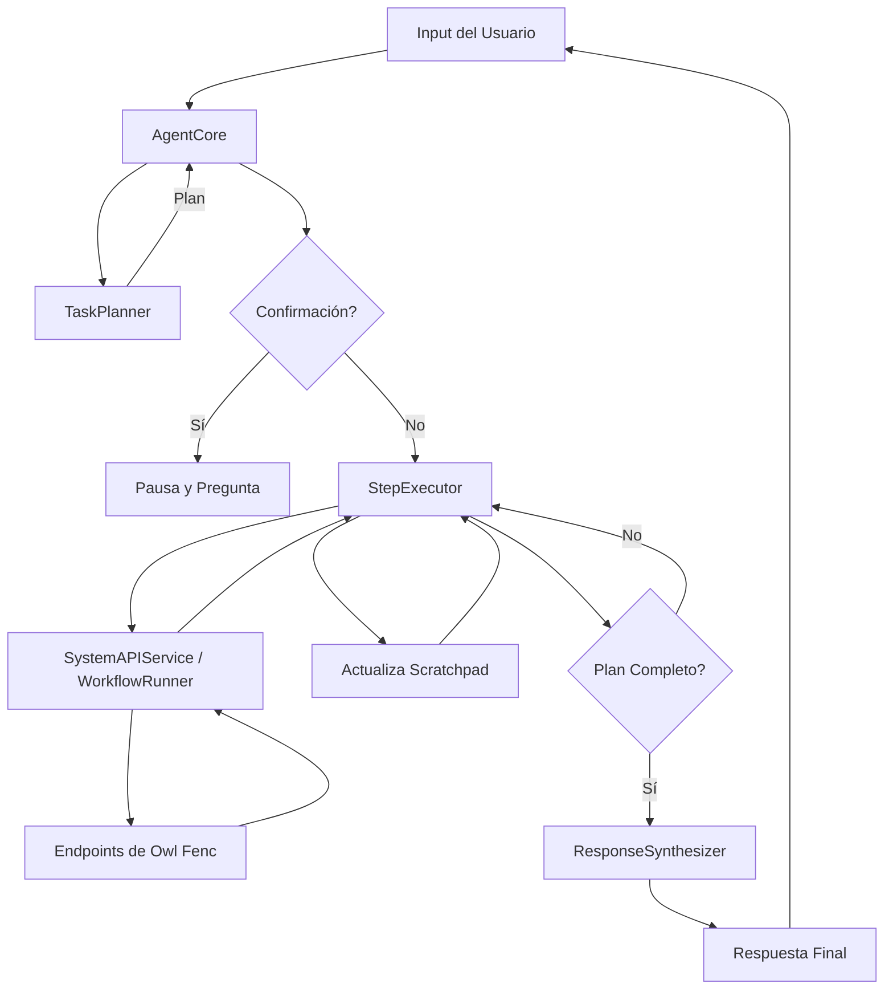

# Mervin V3: Modo Agente - Documentación Técnica

**Autor:** Manus AI
**Fecha:** 30 de Diciembre, 2025
**Versión:** 1.0

## 1. Introducción

Esta documentación técnica describe la arquitectura y el funcionamiento interno del Modo Agente de Mervin V3, un sistema de IA avanzado diseñado para la automatización de tareas complejas dentro de la plataforma Owl Fenc.

## 2. Arquitectura General

El Modo Agente V3 se basa en un patrón **ReAct+P (Reason + Act + Planning)**. Este enfoque permite al agente analizar solicitudes complejas, generar un plan de ejecución dinámico, ejecutarlo paso a paso y reaccionar a los resultados de cada acción.

### 2.1. Componentes Principales

| Componente | Archivo | Responsabilidad |
| :--- | :--- | :--- |
| **AgentCore** | `agent/AgentCore.ts` | Orquesta el ciclo de vida completo de una tarea. |
| **TaskPlanner** | `agent/TaskPlanner.ts` | Analiza la solicitud del usuario y genera un plan de ejecución. |
| **StepExecutor** | `agent/StepExecutor.ts` | Ejecuta cada paso del plan, interactuando con los servicios existentes. |
| **AgentPrompts** | `prompts/AgentPrompts.ts` | Contiene los prompts especializados para planificación y síntesis. |
| **AgentTypes** | `types/agent-types.ts` | Define todas las estructuras de datos y tipos de TypeScript. |

### 2.2. Flujo de Datos



## 3. Componentes Detallados

### 3.1. AgentCore (`agent/AgentCore.ts`)

Es el orquestador principal. Gestiona el estado de la ejecución y coordina la interacción entre los demás componentes.

- **`processRequest(context)`**: Inicia una nueva ejecución. Llama al `TaskPlanner` y decide si ejecutar el plan directamente o solicitar confirmación.
- **`executePlan(executionId)`**: Itera sobre los pasos del plan y los ejecuta usando el `StepExecutor`.
- **`resumeExecution(executionId, userResponse)`**: Reanuda un plan que estaba pausado esperando la confirmación del usuario.
- **`synthesizeResponse(context)`**: Llama al LLM con el prompt de síntesis para generar la respuesta final.

### 3.2. TaskPlanner (`agent/TaskPlanner.ts`)

El cerebro del agente. Utiliza un LLM (Claude 3.5 Sonnet) para convertir una solicitud en lenguaje natural en un plan estructurado.

- **`generatePlan(context)`**: Construye un prompt detallado con el contexto del usuario, las herramientas disponibles y el historial. Llama a la API de Anthropic y parsea la respuesta JSON para crear un `TaskPlan`.
- **`validatePlan(plan, tools)`**: Verifica que el plan generado sea ejecutable (ej: que las herramientas existan).
- **`savePlan(plan, context)`**: (Futuro) Guarda planes exitosos en una base de datos para aprendizaje.

### 3.3. StepExecutor (`agent/StepExecutor.ts`)

El "músculo" del agente. Ejecuta las acciones definidas en cada paso del plan.

- **`executeStepWithRetries(step, scratchpad)`**: Ejecuta un paso con una política de reintentos (exponential backoff).
- **`executeAction(step, scratchpad)`**: Determina si la acción es un workflow (`WorkflowRunner`) o una llamada directa a un endpoint (`SystemAPIService`) y la ejecuta.
- **`resolveParams(params, scratchpad)`**: Resuelve parámetros dinámicos. Por ejemplo, si un parámetro es `"$scratchpad.client.id"`, lo reemplaza con el valor real del scratchpad.
- **`updateScratchpad(scratchpad, action, result)`**: Actualiza la memoria de trabajo con el resultado de la acción ejecutada.

## 4. Prompts y Razonamiento

El comportamiento inteligente del agente se deriva de prompts cuidadosamente diseñados.

- **`PLANNING_SYSTEM_PROMPT`**: Instruye al LLM sobre cómo actuar como un planificador experto, los principios que debe seguir y el formato JSON exacto que debe retornar.
- **`buildPlanningPrompt()`**: Función que recolecta todo el contexto disponible (perfil del usuario, herramientas, historial, etc.) y lo inyecta en el prompt de planificación.
- **`SYNTHESIS_SYSTEM_PROMPT`**: Define la personalidad de Mervin y le instruye sobre cómo generar un resumen amigable y útil de las acciones realizadas.

## 5. Tipos de Datos Clave (`types/agent-types.ts`)

- **`TaskPlan`**: Representa el plan completo, incluyendo la intención, la complejidad y una lista de `PlanStep`.
- **`PlanStep`**: Define una acción individual, sus parámetros, condiciones de éxito y de fallback.
- **`ExecutionContext`**: Contiene el estado completo de una ejecución en curso, incluyendo el plan y el `Scratchpad`.
- **`Scratchpad`**: La memoria de trabajo del agente. Un objeto donde se almacenan los resultados de cada paso para ser utilizados en pasos posteriores.

## 6. Cómo Extender el Agente

### 6.1. Agregar una Nueva Herramienta

1.  **Implementar la Lógica:** Agrega la nueva función en `SystemAPIService.ts` o como un nuevo workflow en `WorkflowRunner.ts`.
2.  **Definir la Herramienta:** Agrega la definición de la herramienta en el archivo de definiciones de herramientas de Claude (`server/mervin-v2/tools/ClaudeToolDefinitions.ts`). Asegúrate de que la descripción sea clara y detallada para que el `TaskPlanner` sepa cuándo usarla.
3.  **Actualizar el `StepExecutor`:** En `executeSystemAPI()`, agrega un `case` para la nueva acción si es una llamada directa.
4.  **Actualizar el `Scratchpad`:** En `updateScratchpad()`, define cómo se debe almacenar el resultado de la nueva herramienta.

### 6.2. Modificar el Comportamiento de Planificación

- **Ajustar el `PLANNING_SYSTEM_PROMPT`**: Para cambiar los principios de planificación o el formato de salida.
- **Mejorar `buildPlanningPrompt()`**: Para agregar más contexto al LLM (ej: historial de proyectos del cliente).
- **Implementar `findSimilarPlans()`**: Para habilitar el aprendizaje a partir de planes exitosos anteriores (few-shot learning).

## 7. Pruebas

El archivo `tests/agent-poc.ts` contiene una prueba de concepto que demuestra el flujo de extremo a extremo. Para ejecutarlo:

```bash
npx ts-node server/mervin-v3/tests/agent-poc.ts
```

Este script simula una solicitud de usuario, genera un plan, solicita confirmación y lo ejecuta, mostrando los resultados en la consola.
